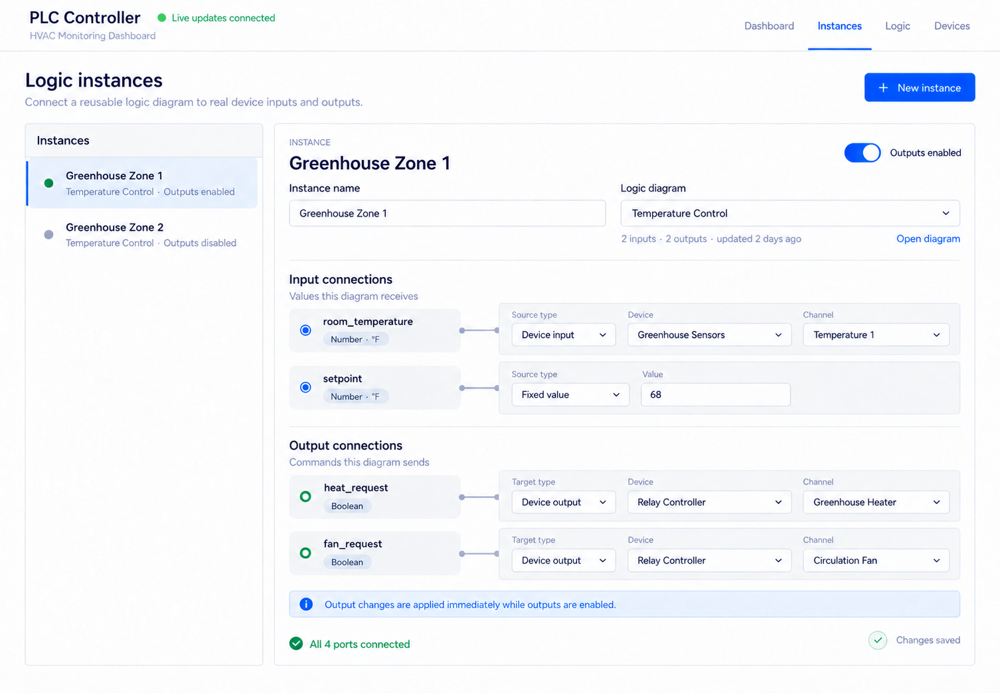

# Logic Diagram Instances

Status: implemented locally on 2026-10-07; not committed or deployed.

## Design

### Goal

Make a `LogicDiagram` a reusable, hardware-independent definition. A diagram owns
named typed inputs, logic blocks, and named typed outputs. A separate
`LogicInstance` selects one diagram and connects its ports to fixed values or
real device I/O.

This is the separation needed to instantiate the same diagram more than once and is
a prerequisite for nesting diagrams later. Nested diagrams are explicitly out
of scope for this task: this task provides stable typed ports, but does not add
child-diagram blocks or polymorphic diagram-to-diagram connections yet.

### User-facing concepts

The approved UX direction is captured in the mockup below. It is a design
reference rather than a pixel-exact implementation requirement; responsive
behavior, validation, conflict states, and per-output connection enablement
still need their implemented states.

- Add **Instances** as a top-level tab. Navigation order is **Dashboard,
  Instances, Logic, Devices**.
- **Logic** edits reusable definitions only. It contains inputs, logic blocks,
  and outputs, with no device selectors, simulation/acquisition modes, output
  enable controls, schedules, or live runtime values.
- **Instances** is the operational view. Its list selects an instance; the
  editor changes the instance name, selected diagram, update period, input
  connections, output connections, and output enablement.
- Instance edits are persisted immediately. There is no draft, publish,
  Save, or Cancel state. The UI shows transaction progress/errors and a
  `Changes saved` acknowledgement.
- Creating an instance still uses a small creation form because the server
  needs a name and diagram for the initial record. Once created, the instance
  is live-edited.
- The instance-level **Outputs enabled** switch is the global hardware-write
  gate. Instances continue evaluating and recording traces while it is off;
  turning it off stops future writes and does not force physical outputs off,
  preserving the current output-enable semantics.
- Each output connection retains a per-connection enable gate. This moves the
  current `OutputBlock#output_enable` behavior into the hardware-specific
  instance layer. New connections default enabled; the instance-level
  switch remains the prominent master control.
- Live edits to an enabled instance are intentionally allowed. They take
  effect on the next applicable runner/poller cycle. The UI does not force the
  user to disable outputs first.
- An instance can be incomplete. Missing input bindings evaluate as `null`;
  missing or disabled output bindings do not write hardware. Completion status
  is shown as, for example, `3 of 4 connected`.

### Domain model

#### Reusable definition

`LogicDiagram`

- `name`
- owns `LogicInput`, `LogicBlock`, and `LogicOutput`
- owns no hardware references, schedule, trace, latest-value helper, or output
  enable state

`LogicInput` (replaces `Measurement`)

- `logic_diagram_id`
- expression-safe `name`, unique within the diagram
- `value_type`: `boolean` or `number`
- optional display `units`
- owns no device, source path, acquisition/simulation mode, fixed value, or
  latest runtime value

`LogicOutput` (replaces `OutputBlock`)

- `logic_diagram_id`
- expression-safe `name`, unique within the diagram
- `value_type`: `boolean` or `number`
- optional display `units`
- `input_expression`, validated against inputs and upstream blocks in the same
  diagram
- owns no device, channel, or enable state

`LogicBlock` remains diagram-owned. Runtime helpers such as `latest_result` and
`output` are removed from diagram-owned records because their result is
ambiguous when a diagram has multiple instances.

#### Runtime instance and real-world connections

`LogicInstance`

- `logic_diagram_id`
- unique operator-facing `name`
- positive `update_period`
- `output_enable`, default false
- owns input bindings, output bindings, and traces
- exposes `latest_trace`

`LogicInputBinding`

- belongs to one instance and one input from that instance's diagram
- unique on `[logic_instance_id, logic_input_id]`
- `source_kind`: initially `device_input` or `fixed_value`
- device input fields: `device_id`, `source_path`
- fixed input field: typed JSON `fixed_value`
- validates that the selected input belongs to the selected diagram, the source
  fields match the source kind, and the device catalog provides a compatible
  value type
- unit labels are displayed, but this task does not perform or imply unit
  conversion

`LogicOutputBinding`

- belongs to one instance and one output from that instance's diagram
- unique on `[logic_instance_id, logic_output_id]`
- `target_kind`: initially `device_output`
- `device_id`, `channel`, and `output_enable` (per-connection gate)
- validates diagram ownership and driver output type compatibility
- inactive instances may bind the same physical `[device_id, channel]`, which
  preserves reusable test/standby configurations. Enabling an instance or
  adding an enabled binding to an active instance is rejected when that would
  create two active writers to one relay.

The kind fields leave a deliberate extension point, but only the kinds required
by this UI are implemented now. Nesting should add its own diagram-definition
connection model rather than prematurely making instance bindings
polymorphic.

### Evaluation and hardware writes

- `Trace` belongs to `LogicInstance`, and reaches its diagram through the
  instance.
- The runner schedules instances by `LogicInstance#update_period`. A
  diagram with no instance is not evaluated.
- Trace evaluation snapshots every logical input from its instance binding,
  evaluates the selected diagram's blocks, and evaluates its logical outputs.
- Stateful block history is read only from earlier traces for the same
  instance. Latches, hysteresis, and timers therefore remain independent
  when the same diagram is instantiated more than once.
- The output writer walks output bindings for instances whose master output
  gate and per-binding gate are enabled. It uses the instance's latest trace
  result for the bound logical output. The poller remains the only process that
  touches hardware.
- Manual `Compute now` creates a trace for an instance, not a diagram. This is
  still ordinary resource creation through `RestfulModelStore`, not an action
  endpoint.
- Trace result schema version 2 uses `logic_inputs`, `logic_blocks`, and
  `logic_outputs` buckets. Existing version-1 trace JSON is retained and remains
  readable; the unchanged `logic_blocks` bucket also preserves state continuity
  across migration.
- Changing an instance's selected diagram is one transactional PATCH. The
  server removes that instance's old bindings and traces so stale port IDs or
  runtime state cannot leak into the newly selected definition. The instance
  itself and its output-enable choice remain.

### API and client state

Add ordinary REST resources and `RestfulApi` serializers for:

- `logic_inputs`
- `logic_outputs`
- `logic_instances`
- `logic_input_bindings`
- `logic_output_bindings`

All frontend I/O continues through `RestfulModelStore`; no component imports
Axios and no verb/action endpoint is added. New models opt into record-change
notifications and are registered with `RecordResources`. API invalidation and
`expound` relationships include their diagram, ports, bindings, and devices so
live edits refresh the existing store correctly.

The root UX tree gains an `instances` page holding the selected instance ID
and the new-instance form state. Hardware dependency links navigate to the
referencing instance rather than to a diagram.

### Dashboard and Logic views

- Dashboard logic summaries become instance summaries. They show instance
  name, selected diagram, update period, output-enable state, bound input
  values, desired logical outputs, and effective hardware-write state.
- The Logic editor renames Measurements to Inputs and Output Blocks to Outputs.
  Input forms edit name/type/units. Output forms edit name/type/units/expression.
- Device selectors, source modes, simulation values, channel selectors, master
  and per-output enable toggles, and runtime values leave the Logic editor.
- `Compute now` moves from Logic to Instances.
- Deleting a diagram cascades its instances, bindings, and traces after the
  existing explicit confirmation. Deleting an instance leaves its reusable
  diagram intact.

### Existing-data migration

The migration preserves current configuration rather than requiring manual
rebinding:

1. Create one instance for every existing diagram, using the diagram name,
   update period, and master output-enable value.
2. Convert each measurement to a logical input with the same ID, name, and
   units. Existing behavior normalized all measurements to numbers, so migrated
   inputs use `number`; newly created inputs may be boolean or number.
3. Convert acquisition measurement fields into a `device_input` binding and
   simulation values into a `fixed_value` binding. An unconfigured acquisition
   measurement remains an unbound input.
4. Convert each output block to a logical output with the same ID, name, and
   expression; current outputs migrate as boolean. Move device/channel and its
   individual enable flag into the corresponding output binding.
5. Attach every existing trace to the generated instance while retaining its
   JSON and source IDs.
6. Move update period and master output enable off `logic_diagrams`; remove the
   old hardware/simulation columns from the renamed logical-port tables.
7. Preserve optimistic locking on every mutable new table and reset copied
   PostgreSQL sequences after retaining IDs.

Use migration-local Active Record classes and direct data transforms rather
than current application models, so future model changes cannot make the data
migration unreplayable.

## Implementation plan

Implementation will follow red-green-refactor. Each phase starts by changing or
adding focused RSpec/frontend tests, observes them fail for the intended reason,
implements the smallest coherent slice, and runs the focused suite before the
full suite.

### 1. Lock down the new domain and migration behavior

- Add failing model specs for diagram ownership, typed port validation,
  instance defaults/schedule, binding kind fields, binding compatibility,
  cross-diagram rejection, unique port bindings, and exclusive active physical
  output ownership.
- Add a migration/backfill spec or migration-focused integration spec covering
  acquisition, simulation, enabled and disabled outputs, incomplete inputs, and
  historical traces.
- Add the new tables/foreign keys/indexes and perform the ID-preserving backfill
  and table transition described above.
- Replace `Measurement`/`OutputBlock` with `LogicInput`/`LogicOutput`; add the
  instance and binding models. Update diagram associations and deletion
  cascades.

### 2. Make evaluation instance-scoped

- Add failing evaluator specs showing two instances of one diagram receive
  different bound input values and retain independent hysteresis/latch/timer
  state.
- Add cases for fixed values, device booleans/numbers, unbound inputs, typed
  output evaluation, unbound outputs, and v1 trace reads.
- Move trace creation/evaluation context and previous-state lookup from diagrams
  to instances. Write trace schema v2 while retaining the v1 reader.
- Remove ambiguous latest-result helpers from diagram-owned records and expose
  instance-scoped result lookup.

### 3. Move scheduling and output writing to instances

- Change runner specs first: it discovers, independently schedules, retries,
  and deletes instances rather than diagrams; diagrams without instances
  do not run.
- Change output evaluator/writer specs first: both enable gates are required,
  unbound or null outputs are skipped, and two instances of one diagram issue
  commands from their own latest traces.
- Update `LogicRunner`, `DiagramEvaluator` (renamed to an instance evaluator),
  `OutputEvaluator`, and `OutputWriter`. Keep all actual writes in `Poller`.
- Preserve the current behavior that disabling or disconnecting an output stops
  future writes but does not issue an automatic close command.

### 4. Move hardware dependency protection to bindings

- Change hardware-configuration and request specs so device deletion and driver
  changes inspect input/output bindings.
- Update locking-on-save so a binding locks its referenced device and rechecks
  its driver catalog after the lock is acquired.
- Update server dependency payloads and frontend `computeImpact` types to name
  the instance and logical port. Links open the Instances tab with the
  relevant record selected.

### 5. Expose the REST resources and store models

- Add failing request specs for create/list/update/destroy, flat wire format,
  filtering, diagram-switch cleanup, invalid binding combinations, optimistic
  locking, expounded records, and cache invalidation.
- Add routes, controllers, `RestfulApi` classes, record-resource mappings, and
  serializers for the five new resources; remove obsolete measurement and
  output-block API fields/resources.
- Add TypeScript store definitions and store tests. Extend the root loader with
  instances and bindings while retaining bounded cache behavior and live
  record subscriptions.

### 6. Simplify the Logic editor

- Change component tests first so Logic renders definition-only Inputs and
  Outputs and no longer renders device/simulation/output-enable controls or
  runtime values.
- Replace `MeasurementForm/Card` with logical input equivalents and
  `OutputBlockForm/Card` with logical output equivalents.
- Remove the diagram output toggle and `Compute now`; keep definition CRUD and
  existing block editing/dependency validation.
- Update diagram-deletion copy to mention instances among the cascaded data.

### 7. Build the top-level Instances UX

- Add the `instances` UX subtree and reorder top navigation to Dashboard,
  Instances, Logic, Devices.
- Add component tests for selection, creation, empty/loading states, completion
  counts, live field patches, diagram changes, fixed/device input controls,
  output device/channel controls, per-connection enablement, master output
  enablement, transaction errors/conflicts, and `Changes saved` feedback.
- Implement the mockup's two-column instance list/editor. Device and channel
  options come only from the loaded device catalogs. Each change uses store
  create/patch/destroy calls.
- Put `Compute now` on the selected instance using `Trace.create` with
  `logic_instance_id`.

### 8. Make monitoring instance-centric

- Change dashboard tests and cards to group runtime inputs/outputs by
  instance, not definition.
- Show both diagram and instance names and distinguish desired logical output
  from whether a hardware write is effective.
- Update empty states and any device-dependency copy/links that still refer to
  measurements or output assignments inside Logic.

### 9. Full verification and documentation

- Run focused specs throughout, then the complete RSpec suite, frontend tests,
  TypeScript check, and frontend production build.
- Run migration up/down/up in development/test where the migration's data
  contract permits it, and verify copied counts/foreign keys/sequence values.
- Use the existing Playwright helper for a real-browser pass of all four tabs at
  desktop and narrow widths. Do not start a second poller or use port 3001; if a
  separate API is needed, use Rails-only port 3002 and stop it afterward.
- Check live editing with outputs disabled first, then verify that an enabled
  instance supplies output commands through the poller boundary without the
  web process touching hardware.
- Update `claude/overview.md` with the final model, entry points, runtime
  ownership, validation totals, and any instance/restart requirements.

## Acceptance criteria

- The same diagram can have two instances with different fixed/device input
  bindings, output targets, schedules, traces, and retained block state.
- Diagram records contain no real-device references, simulation values,
  runtime schedule, trace ownership, or output enablement.
- All output enablement lives under instances/bindings; enabled live edits are
  allowed and are picked up on the next runner/poller cycle.
- Incomplete instances evaluate safely and never write unbound outputs.
- One physical output cannot have two enabled bindings on enabled instances;
  inactive instances may retain overlapping standby/test connections.
- Existing diagrams, measurements, outputs, enable flags, and traces migrate to
  behaviorally equivalent instances without losing historical trace JSON.
- Dashboard/Instances/Logic/Devices appears in that order, and the
  Instances screen matches the approved interaction model.
- All server I/O uses `RestfulModelStore`; all state changes remain resource
  creates/patches/deletes.
- Full backend/frontend tests, type checking, build, and Playwright smoke checks
  pass before implementation is presented as complete.

## Implementation result

The implementation follows the model and UX above. The development and test
databases have the instance migration applied; the development database had no
legacy diagrams, inputs, outputs, or traces at migration time. Production was
not migrated or restarted.

Verification completed on 2026-10-07:

- 216 RSpec examples pass, including restored edge-case coverage for retained
  state, null propagation, output gates, scheduling, and runner locking.
- 61 Vitest tests pass, including direct instance creation, binding, master
  enable, and manual-compute interactions.
- TypeScript checking, the production frontend build, and `git diff --check`
  pass.
- Playwright rendered Dashboard and Instances against a Rails-only server on
  port 3002. The populated Instances editor was inspected at desktop and 390px
  widths with outputs disabled; a final run from the allowlisted development
  origin completed without console or page errors. Temporary visual-check data
  and servers were removed afterward.
- Follow-up remote testing corrected the development API/Cable host derivation,
  Rails HostAuthorization, and the MagicDNS Cable origin. A Playwright run from
  `executivealpha.hamlet-vibes.ts.net:5174` loaded API data and reached `Live
  updates connected` without console errors.
